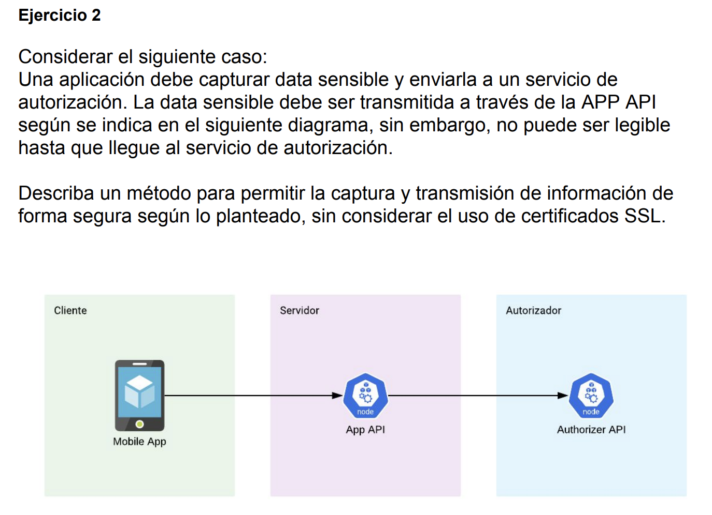

# **IONIX Excercise**

El proyecto de ejercicio, presenta 4 servicios distintos, unos para administración de Usuarios y otro particularmente para utilizar un servicio externo y exponer un resultado en base a esta data obtenida.

El proyecto tiene un script para la creación de la BD: **ionix-scripts/ionix_users.sql**

Por configuración, la aplicación se deploya en el puerto 8080.

------------------------------------------------------------

## **Servicios Usuarios**

#### 1.	Crear Usuario

**URL:** <http://localhost:8080/user/addUser>  
**Tipo:** POST

**Request:**

	{
		"name": "Sergio Martinez",
		"username": "smartinez",
		"email": "sergio.martinez.g@gmail.com",
		"phone": "324234234"
	}

#### 2.	Listar todos los Usuarios

**URL:** <http://localhost:8080/user/allUsers>  
**Tipo:** GET

#### 3.	Obtener Usuario por correo

**URL:** <http://localhost:8080/user/getUserByEmail?email=>  
**Tipo:** GET

**Ejemplo:** <http://localhost:8080/user/getUserByEmail?email=sergio.martinez.g@gmail.com>

------------------------------------------------------------

## **Servicio de Busqueda RUT**

**URL:** <http://localhost:8080/api/searchRut>  
**Tipo:** POST

**Parametro:** [**param=**rut]  
**Ejemplo:** [param=1-9]

## Test Unitarios
Se encuentran disponible 3 test unitarios utilizando JUNIT:

*   SearchRutControllerTest.java
*   UserControllerTest.java
*	SearchServiceTest.java
  
  

------------------------------------------------------------

## Ejercicio 2

 

Respecto a la seguridad de información, si bien se destaca el no uso de Certificados SSL, creo que el uso del protocolo TLS es adecuado para la encriptación de datos sensibles, utilizando Certificado TLS. 

###### Autor: Sergio Martínez&copy; 
	